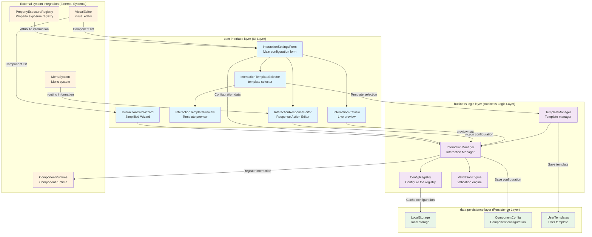

# core interactive system (Core Interaction System)

> A fully functional、Well-designed visual interactive configuration and management system，used forThingsPanelCustomization of component interaction behavior of front-end platform。

## 📋 System overview

**core interactive system**yesThingsPanelA key module in front-end architecture，Specially responsible for handling the interaction logic configuration and management between components。The system adopts modular design，Provides complete solutions from basic configuration to advanced customization。

### 🎯 design goals

- **Visual configuration**：through intuitiveUIInterface configuration complex interaction logic
- **Modular architecture**：Highly decoupled component design，Easy to expand and maintain
- **type safety**：completeTypeScripttype definition，确保开发时的type safety
- **Live preview**：WYSIWYG interactive effect preview function
- **Templating support**：Preset and custom template systems

## 🏗️ System architecture

```
src/core/interaction-system/
├── index.ts                          # Unified export portal
├── managers/
│   └── ConfigRegistry.ts             # Configure component registration manager
└── components/
    ├── InteractionSettingsForm.vue   # Main configuration form component
    ├── InteractionResponseEditor.vue # Response Action Editor  
    ├── InteractionTemplateSelector.vue # template selector
    ├── InteractionPreview.vue        # Live preview of components
    ├── InteractionTemplatePreview.vue # Template preview component
    └── InteractionCardWizard.vue     # Simplified configuration wizard
```

### Core architectural features

1. **layered design**：manager layer + Clear layered architecture at the component level
2. **single responsibility**：Each component focuses on a specific functional area
3. **Scalability**：Support custom configuration components through registration mechanism
4. **Status management**：based onVue 3 Composition API的响应式Status management

## 🚀 Core features

### 1. Interactive configuration management (`InteractionSettingsForm`)

**Main responsibilities**：Provides a visual interactive configuration interface

**Core features**：
- ✅ **Multiple trigger events**：support `click`、`hover`、`dataChange` etc events
- ✅ **conditional execution system**：Conditional triggering mechanism based on attribute changes
- ✅ **response action chain**：Supports serial execution of multiple response actions
- ✅ **Property exposure integration**：Deep integration with property exposure registry
- ✅ **Visual Editorintegrated**：Supports obtaining canvas components for cross-component interaction

**Technical Highlights**：
```vue
// Supported trigger event types
const coreEventOptions = [
  { label: 'click event', value: 'click' },
  { label: 'hover event', value: 'hover' }, 
  { label: 'Visibility changes', value: 'visibility' },
  { label: 'Data changes', value: 'dataChange' }
]

// Smart attribute selection
const availablePropertyOptions = computed(() => {
  const componentExposure = propertyExposureRegistry.getComponentExposure(componentType)
  return componentExposure?.listenableProperties || []
})
```

### 2. Response Action Editor (`InteractionResponseEditor`)

**Main responsibilities**：Finely configure the parameters of interactive response actions

**Core functions**：
- 🎯 **URLJump configuration**：Support external links and internal menu jumps
- 🎯 **Component data update**：Cross-component property modification function
- 🎯 **Advanced options**：Delayed execution、Advanced configuration such as execution conditions
- 🎯 **Live preview**：Instant effect preview of response actions

**design pattern**：
```typescript
// Response action configuration structure
interface InteractionResponse {
  action: InteractionActionType
  value: any
  delay?: number        // Delayed execution
  duration?: number     // Execution time
  target?: string       // Jump target
  // Update configuration across components
  targetComponentId?: string
  targetProperty?: string  
  updateValue?: any
  updateMode?: 'replace' | 'append' | 'prepend'
}
```

### 3. template system (`InteractionTemplateSelector`)

**Main responsibilities**：Provides preset template and custom template management

**Template classification**：
- 📚 **basic interaction**：Click to highlight、Common effects such as hover zoom
- 🎨 **visual effects**：rainbow border、Visual interactions such as transparency switching
- 🎬 **Animation effects**：pulse animation、Dynamic effects such as vibration prompts  
- ⚙️ **composite interaction**：Complex interaction logic of multiple event combinations
- 👤 **User defined**：支持导入和保存User defined模板

**Technical implementation**：
```typescript
// template data structure
interface InteractionTemplate {
  id: string
  name: string
  description: string
  category: 'basic' | 'visual' | 'animation' | 'complex' | 'user'
  icon: any
  color: string
  config: InteractionConfig[]  // Complete interactive configuration
  tags?: string[]
}
```

### 4. Live preview system (`InteractionPreview`)

**Main responsibilities**：Provide real-time preview and testing of interactive effects

**Preview function**：
- 🎮 **interactive testing**：Simulate various event triggering effects
- 📊 **execution log**：Record the interactive execution process in detail
- 🎛️ **Configuration control**：Dynamically enabled/Disable specific interaction configurations
- 📈 **Performance monitoring**：Interaction response time and execution status monitoring

### 5. Template preview component (`InteractionTemplatePreview`)

**Main responsibilities**：Provides detailed preview and demonstration capabilities of interactive templates

**Core features**：
- 📋 **Template information display**：Show template name in full、Description and statistics
- 🎨 **Configuration details view**：Display the interactive configuration and response actions included in the template item by item
- 🎮 **Real-time effect demonstration**：Provide interactive presentation elements，Real-time display of template effects
- 💾 **Template export function**：Supports exporting templates asJSONFile for use in other projects

**Technical implementation**：
```typescript
// Template preview core logic
const executeDemoResponse = (response: InteractionResponse) => {
  const { action, value, duration = 300, easing = 'ease' } = response
  
  // set upCSStransition effect
  element.style.transition = `all ${duration}ms ${easing}`
  
  // Perform corresponding effects based on action type
  switch (action) {
    case 'changeBackgroundColor':
      element.style.backgroundColor = value
      break
    case 'triggerAnimation':
      element.style.animation = `${value} ${duration}ms ${easing}`
      break
    // ... More action handling
  }
}
```

### 6. Simplified configuration wizard (`InteractionCardWizard`)

**Main responsibilities**：Provides a lightweight configuration interface for mobile terminals and simplified scenarios

**design features**：
- 📱 **Mobile optimization**：Interactive experience optimized for small screen devices
- ⚡ **Quick configuration**：Simplify configuration steps through pop-ups and wizard-based processes
- 🎯 **Focus on core functions**：Keep only the most commonly used interaction types and configuration options
- 📝 **summary display**：Display configured interactions in a concise summary form

### 7. Configure the registration manager (`ConfigRegistry`)

**Main responsibilities**：manageCard 2.1Custom configuration panel for components

**Registration mechanism**：
```typescript
class ConfigRegistry {
  // Register a custom configuration component
  register(componentId: string, configComponent: IConfigComponent): void
  
  // Get configuration components
  get(componentId: string): IConfigComponent | undefined
  
  // Check if custom configuration exists
  has(componentId: string): boolean
}
```

## 🔧 Detailed explanation of technical architecture

### System architecture design drawing



### core type definition

```typescript
// Interactive configuration core interface
interface InteractionConfig {
  event: InteractionEventType           // trigger event
  responses: InteractionResponse[]      // Response action list
  enabled: boolean                      // Whether to enable
  priority?: number                     // execution priority
  name?: string                         // Configuration name
  
  // Conditional execution related
  condition?: ConditionConfig           // Execution conditions
  watchedProperty?: string              // Listening properties
  sourceComponentType?: string          // Source component type
  
  // Cross-component interaction
  targetComponentId?: string            // target componentID
}

// Conditional configuration
interface ConditionConfig {
  type: 'comparison' | 'range' | 'expression'
  operator?: ComparisonOperator
  value?: any
  minValue?: any
  maxValue?: any
  expression?: string
}

// response action type
type InteractionActionType = 
  | 'navigateToUrl'           // URLJump
  | 'updateComponentData'     // Update component data
  | 'changeVisibility'        // change visibility
  | 'triggerAnimation'        // trigger animation
  // ... More action types
```

### Design pattern application

1. **Registry mode (Registry Pattern)**
   - `ConfigRegistry` Manage custom configuration components
   - Support dynamic registration and query

2. **strategy pattern (Strategy Pattern)**  
   - Different response action types correspond to different processing strategies
   - Easily extendable with new action types

3. **Combination mode (Composite Pattern)**
   - Response actions can be combined into complex interaction sequences
   - Supports nested and recursive execution

4. **Observer pattern (Observer Pattern)**
   - based onVueResponsive system implements state change monitoring
   - Property changes trigger interactive execution

## 📦 User Guide

### 1. Basic integration

```typescript
// Import interactive system components
import { 
  InteractionSettingsForm,
  InteractionResponseEditor,
  InteractionTemplateSelector,
  InteractionPreview,
  ConfigRegistry
} from '@/core/interaction-system'
```

### 2. Register a custom configuration component

```typescript
// Register component-specific configuration panels
import { configRegistry } from '@/core/interaction-system'

configRegistry.register('my-component', {
  component: MyCustomConfigPanel,
  props: { /* Configuration properties */ },
  validators: { /* Validation rules */ }
})
```

### 3. existVisual EditorCentral integration

```vue
<template>
  <div class="component-config-panel">
    <!-- Other configuration items -->
    
    <!-- Interactive configuration section -->
    <InteractionSettingsForm
      v-model="interactionConfigs"
      :component-id="currentComponentId"
      :component-type="currentComponentType"
      :readonly="isReadonly"
      @change="handleInteractionChange"
    />
  </div>
</template>

<script setup lang="ts">
import { InteractionSettingsForm } from '@/core/interaction-system'
import type { InteractionConfig } from '@/card2.1/core/interaction-types'

const interactionConfigs = ref<InteractionConfig[]>([])

// Handling interactive configuration changes
const handleInteractionChange = (configs: InteractionConfig[]) => {
  // Save to component configuration
  currentComponent.value.interactionConfigs = configs
  
  // Trigger re-rendering or other logic
  updateComponentConfig()
}
</script>
```

### 4. Template usage example

```typescript
// Use template selector
const applyTemplate = (template: InteractionConfig) => {
  // Apply template to current component
  interactionConfigs.value.push({
    ...template,
    name: `${template.name} (from template)`
  })
}

// Custom template import
const importCustomTemplate = (templateJson: string) => {
  const template = JSON.parse(templateJson)
  // Validate and apply templates
  if (validateTemplate(template)) {
    userTemplates.value.push(template)
  }
}
```

## 🛠️ Advanced configuration

### 1. Conditional execution configuration

```typescript
// Configure data change trigger conditions
const dataChangeConfig: InteractionConfig = {
  event: 'dataChange',
  watchedProperty: 'temperature',  // Monitor temperature properties
  condition: {
    type: 'comparison',
    operator: 'greaterThan',
    value: 30                      // when temperature > 30triggered when
  },
  responses: [{
    action: 'changeVisibility',
    value: 'visible'               // Show warning component
  }]
}
```

### 2. Cross-component interaction configuration

```typescript
// Configure cross-component property modifications
const crossComponentConfig: InteractionConfig = {
  event: 'click',
  responses: [{
    action: 'updateComponentData',
    targetComponentId: 'chart-component-001',
    targetProperty: 'chartType', 
    updateValue: 'bar',
    updateMode: 'replace'
  }]
}
```

### 3. compound action sequence

```typescript
// Configure a multi-step response sequence
const complexInteraction: InteractionConfig = {
  event: 'hover',
  responses: [
    {
      action: 'changeBackgroundColor',
      value: '#f0f0f0',
      duration: 200
    },
    {
      action: 'triggerAnimation',
      value: 'pulse',
      delay: 200,        // delay200msimplement
      duration: 1000
    }
  ]
}
```

## 🎯 best practices

### 1. Performance optimization suggestions

- ✅ **Fair use conditions enforced**：Avoid too frequent property monitoring
- ✅ **Optimize response actions**：Use appropriate delays and duration controls
- ✅ **Limit interaction complexity**：Avoid long response action chains
- ✅ **Clean up resources promptly**：Unregister the interaction listener when the component is destroyed

### 2. User experience optimization

- 🎨 **Provide preview function**：Allow users to instantly view interaction effects
- 🎨 **Templated common configurations**：Reduce duplication of configuration work
- 🎨 **Smart defaults**：Provide sensible default configurations based on context
- 🎨 **Error handling and prompts**：Friendly error messages and operating instructions

### 3. maintainability principle

- 🔧 **type safety**：Make full use ofTypeScripttype system
- 🔧 **Component decoupling**：through events andpropsCommunicate between components
- 🔧 **Configuration verification**：Implement a complete configuration data verification mechanism
- 🔧 **Complete documentation**：Provide detailed documentation for custom extensions

## 🔍 Debugging and troubleshooting

### Frequently Asked Questions

1. **Interaction does not take effect**
   ```typescript
   // Check whether the interaction configuration is correctly registered
   console.log('[Interactive debugging]', interactionManager.getComponentConfigs(componentId))
   
   // Check if property exposure is configured correctly
   console.log('[Property debugging]', propertyExposureRegistry.getComponentExposure(componentType))
   ```

2. **Cross-component interaction failed**
   ```typescript
   // Check if target component exists
   const targetExists = visualEditorState.getAvailableComponents()
     .find(comp => comp.id === targetComponentId)
   console.log('[target component]', targetExists)
   ```

3. **Template loading failed**
   ```typescript
   // Validate template format
   const validateTemplate = (template: any) => {
     return template.name && 
            template.config && 
            Array.isArray(template.config)
   }
   ```

## 🚀 Extended development

### Add new response action type

1. **Extended type definition**
   ```typescript
   // exist interaction-types.ts Add new type in
   type InteractionActionType = 
     | 'navigateToUrl'
     | 'updateComponentData' 
     | 'myCustomAction'     // New action type
   ```

2. **Implement action processing logic**
   ```typescript
   // exist InteractionResponseEditor Add configuration interface in
   const handleCustomAction = () => {
     // Parameter configuration logic for custom actions
   }
   ```

3. **Register to the system**
   ```typescript
   // Register new actions in the corresponding options list
   const actionTypeOptions = [
     // ... Existing options
     { label: 'My custom action', value: 'myCustomAction' }
   ]
   ```

## 📊 System monitoring and performance

### Performance Benchmarks

| Performance indicators | base value | Excellent performance | illustrate |
|----------|--------|----------|------|
| **Interactive response time** | < 100ms | < 50ms | The time from event triggering to completion of action execution |
| **Configure load time** | < 200ms | < 100ms | Loading and parsing time of component interaction configuration |
| **Template rendering time** | < 150ms | < 75ms | Full rendering time of template selector |
| **Preview start time** | < 300ms | < 150ms | Preview component initialization and first render time |
| **Memory usage** | < 5MB | < 2MB | Memory usage of the entire interactive system |
| **Configure storage size** | < 100KB | < 50KB | Full interactive configuration size of a single component |

### System monitoring capabilities

The interactive system provides complete debugging and monitoring capabilities：

#### 🔍 Debugging and Diagnostics
- **Detailed logging**：Hierarchical recording interaction configuration、Execution process and error messages
- **Perform link tracing**：Completely trace the entire execution link of an interaction from trigger to completion
- **Performance Analyzer**：Built-in performance analysis tools，Monitor time spent on key operations
- **status snapshot**：支持在任意时间点导出系统status snapshot用于问题诊断

#### 📈 Performance monitoring
- **Response time statistics**：Real-time monitoring of average response times andP99Delay
- **Perform frequency analysis**：Statistics on trigger frequency and hotspot analysis of different interaction types
- **资源使用monitor**：monitorCPU、Memory、DOMResource usage such as operations
- **Error rate statistics**：Track interactive execution failure rate and error type distribution

#### 🎯 Runtime monitoring
- **Configure status tracking**：Real-time monitoring of all interactive configuration enablements/disabled state
- **Component health check**：Regularly check the existence and accessibility of associated components
- **Dependency monitoring**：Monitor dependency integrity across component interactions
- **User behavior analysis**：Collect user interaction behavior data for system optimization

#### 🛠️ Developer Tools
- **Vue DevToolsintegrated**：supportVue DevToolsDebugging component status
- **Browser extension support**：Provides specialized browser extensions for in-depth debugging
- **APItesting tools**：built-inAPIInterface testing and verification tools
- **Configure validator**：Verify the correctness and completeness of interactive configurations in real time

#### 📊 Data Statistics and Analysis

```typescript
// Performance monitoring data structure
interface PerformanceMetrics {
  // Response time statistics
  responseTime: {
    average: number        // average response time
    p95: number           // 95Quantile
    p99: number           // 99Quantile
    max: number           // maximum response time
  }
  
  // Execution statistics
  execution: {
    totalCount: number     // Total execution times
    successRate: number    // success rate
    errorRate: number      // error rate
    avgPerSecond: number   // average number of executions per second
  }
  
  // Resource usage
  resources: {
    memoryUsage: number    // Memory usage(MB)
    cpuUsage: number       // CPUUsage rate(%)
    domOperations: number  // DOMNumber of operations
  }
}

// Get performance monitoring data
const metrics = interactionManager.getPerformanceMetrics()
console.log('Interactive system performance indicators:', metrics)
```

## 📚 Related documents

- [Card 2.1 data binding system](../card2.1/DATA_BINDING_SYSTEM_SUMMARY.md)
- [Property exposure registry](../card2.1/core/property-exposure/README.md)
- [Visual Editor Architecture Guide](../components/visual-editor/ARCHITECTURE_GUIDE.md)
- [Interaction type definition](../card2.1/core/interaction-types.ts)

---

## 🏆 Summarize

The core interactive system isThingsPanelOne of the front-end architecture**Technical benchmark**，Reflects the following design advantages：

- ✨ **Architecture advancement**：Adopt modern component design patterns and type safety mechanisms
- ✨ **functional completeness**：Comprehensive support from basic configuration to advanced customization
- ✨ **user experience**：Visual configuration、Live preview、Templating support
- ✨ **Expansion capabilities**：Support unlimited expansion through registration mechanism and plug-in design
- ✨ **Project quality**：complete type definition、Error handling and debugging support

This system not only solves the technical problem of interactive configuration of components，More importantly, it provides developers with a**Visualization、Templating、Intelligent**interaction design tools，Greatly improve development efficiency and user experience。

---

*Document version：v1.0 | last updated：2024Year*